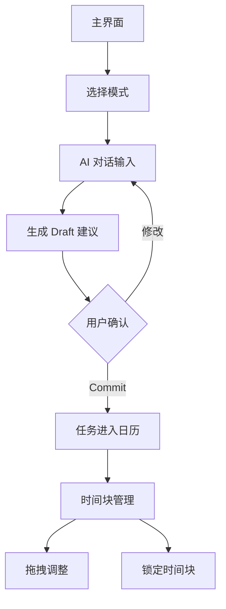

## 1. Product Overview
Chronus AI 是一款智能时间管理与任务规划系统，通过 AI 对话生成个性化任务建议，帮助用户高效安排时间。
用户通过自然语言与 AI 交互，系统根据三种模式（Todo/Study/Final）智能生成任务计划，支持拖拽调整与生命周期管理。

## 2. Core Features

### 2.1 User Roles
| Role | Registration Method | Core Permissions |
|------|---------------------|------------------|
| Normal User | Email registration | 使用 AI 对话、任务管理、日历操作 |
| Premium User | Subscription upgrade | 高级 AI 功能、数据分析、导出功能 |

### 2.2 Feature Module
Chronus AI 包含以下核心页面：
1. **主界面**：左右分栏布局，左侧交互面板，右侧日历面板
2. **设置页面**：用户活跃时间、能量偏好、外部日历同步配置

### 2.3 Page Details
| Page Name | Module Name | Feature description |
|-----------|-------------|---------------------|
| 主界面 | 模式切换器 | 切换 Todo/Study/Final 三种任务模式，控制 AI 生成逻辑 |
| 主界面 | Chat Feed | 显示用户与 AI 的对话历史，支持自然语言输入 |
| 主界面 | Draft Slot | 展示 AI 生成的任务建议卡片，包含任务名、时长、优先级、原因说明 |
| 主界面 | 日历视图 | 日/周视图切换，显示时间块分布 |
| 主界面 | 时间块管理 | 实色块表示已确认任务，半透明幽灵块表示 AI 建议，支持拖拽调整与锁定 |
| 设置页面 | 用户配置 | 设置活跃时间区间、能量偏好（高/中/低）、外部日历同步选项 |

## 3. Core Process
用户操作流程：
1. 用户进入主界面，选择任务模式（Todo/Study/Final）
2. 在 Chat Feed 中输入需求，如"帮我安排本周学习计划"
3. AI 生成任务建议，显示在 Draft Slot 中
4. 用户查看建议详情，点击 Commit 确认任务
5. 任务进入日历，生成对应时间块
6. 用户可拖拽调整时间块，或锁定避免 AI 重排

## 4. User Interface Design

### 4.1 Design Style
- **主色调**：深蓝色 (#1E3A8A) 与白色背景对比
- **按钮样式**：圆角矩形，悬停状态轻微阴影
- **字体**：系统默认字体，标题 18px，正文 14px
- **布局风格**：卡片式布局，左右分栏固定比例
- **图标风格**：简洁线性图标，配合 emoji 状态标识

### 4.2 Page Design Overview
| Page Name | Module Name | UI Elements |
|-----------|-------------|-------------|
| 主界面 | 模式切换器 | 顶部标签页，当前选中高亮显示，切换动画流畅 |
| 主界面 | Chat Feed | 聊天气泡样式，用户消息右对齐，AI 消息左对齐，带头像 |
| 主界面 | Draft Slot | 卡片阴影效果，Commit 按钮醒目绿色，悬停放大 |
| 主界面 | 日历视图 | 网格布局，时间块圆角边框，幽灵块 50% 透明度 |
| 主界面 | 时间块 | 拖拽手柄图标，锁定状态显示锁形图标，颜色区分模式 |

### 4.3 Responsiveness
桌面优先设计，支持 1280px 以上屏幕最佳显示。移动端适配采用响应式布局，保持核心功能可用性。