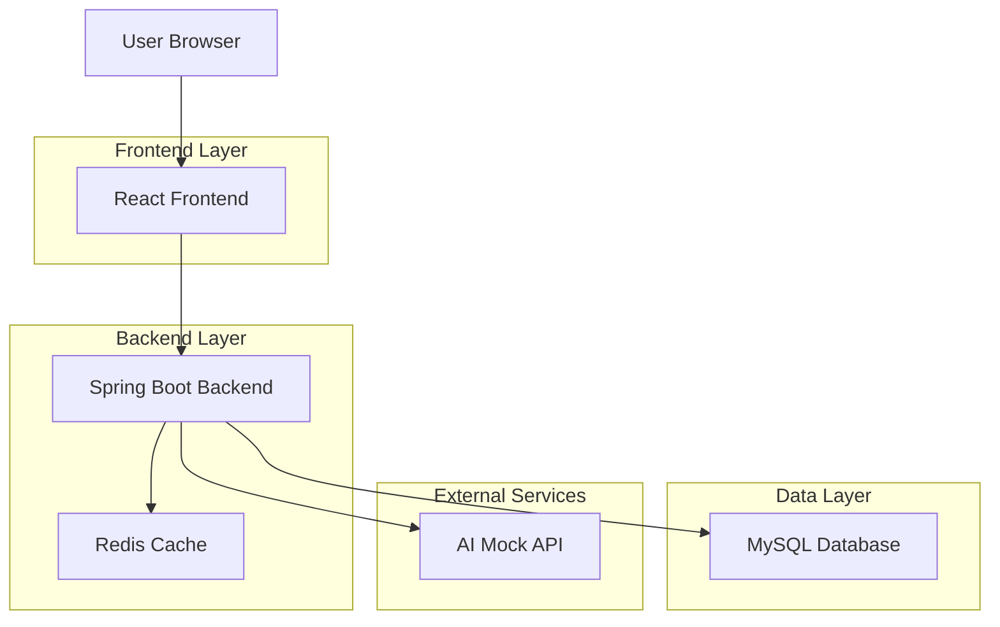
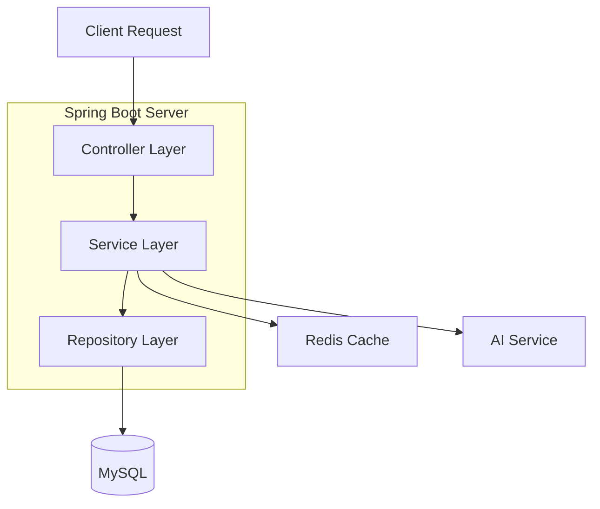
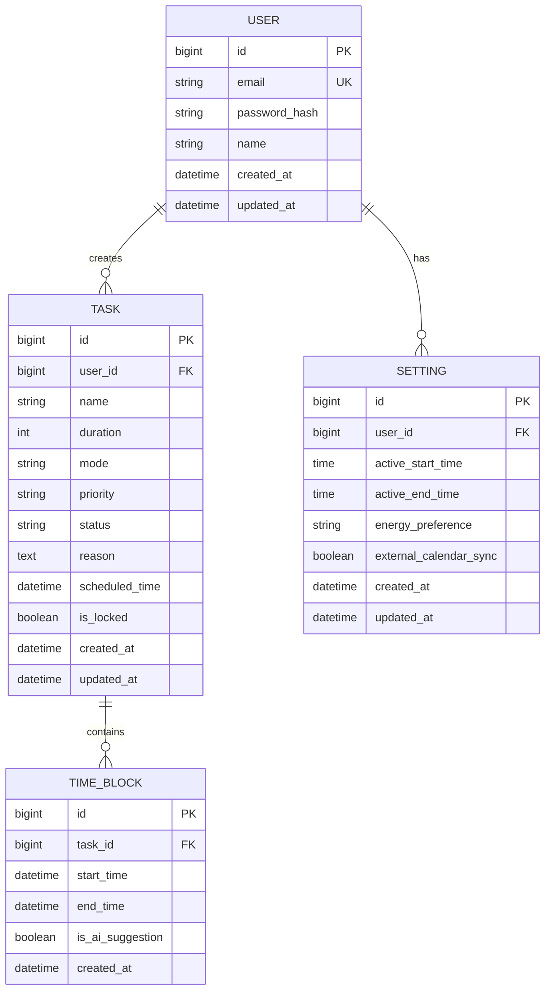

## 1. Architecture design



## 2. Technology Description

- **Frontend**: React@18 + TypeScript + Tailwind CSS + Vite
- **Initialization Tool**: vite-init
- **Backend**: Java 17 + Spring Boot 3.x + Spring Security + JWT
- **Database**: MySQL 8.x
- **Cache**: Redis
- **AI Integration**: Mock API (fakeAiApiRequest) with环境变量配置

## 3. Route definitions

| Route | Purpose |
|-------|---------|
| / | 主界面，显示左右分栏布局 |
| /settings | 设置页面，用户偏好配置 |
| /api/auth/login | 用户登录接口 |
| /api/auth/register | 用户注册接口 |
| /api/tasks | 任务管理接口 |
| /api/ai/suggest | AI 任务建议接口 |

## 4. API definitions

### 4.1 Authentication API

```
POST /api/auth/login
```

Request:
| Param Name | Param Type | isRequired | Description |
|------------|------------|------------|-------------|
| email | string | true | 用户邮箱 |
| password | string | true | 密码 |

Response:
| Param Name | Param Type | Description |
|------------|------------|-------------|
| token | string | JWT token |
| user | object | 用户信息 |

### 4.2 Task Management API

```
POST /api/tasks
```

Request:
| Param Name | Param Type | isRequired | Description |
|------------|------------|------------|-------------|
| name | string | true | 任务名称 |
| duration | number | true | 预计时长(分钟) |
| mode | string | true | 任务模式(todo/study/final) |
| priority | string | true | 优先级 |
| scheduledTime | datetime | false | 计划时间 |

### 4.3 AI Suggestion API

```
POST /api/ai/suggest
```

Request:
| Param Name | Param Type | isRequired | Description |
|------------|------------|------------|-------------|
| input | string | true | 用户输入的自然语言 |
| mode | string | true | 当前任务模式 |

Response:
| Param Name | Param Type | Description |
|------------|------------|-------------|
| suggestions | array | 任务建议列表 |

## 5. Server architecture diagram



## 6. Data model

### 6.1 Data model definition



### 6.2 Data Definition Language

User Table (users)
```sql
CREATE TABLE users (
    id BIGINT PRIMARY KEY AUTO_INCREMENT,
    email VARCHAR(255) UNIQUE NOT NULL,
    password_hash VARCHAR(255) NOT NULL,
    name VARCHAR(100) NOT NULL,
    created_at TIMESTAMP DEFAULT CURRENT_TIMESTAMP,
    updated_at TIMESTAMP DEFAULT CURRENT_TIMESTAMP ON UPDATE CURRENT_TIMESTAMP,
    INDEX idx_email (email)
);
```

Task Table (tasks)
```sql
CREATE TABLE tasks (
    id BIGINT PRIMARY KEY AUTO_INCREMENT,
    user_id BIGINT NOT NULL,
    name VARCHAR(255) NOT NULL,
    duration INT NOT NULL,
    mode ENUM('todo', 'study', 'final') NOT NULL,
    priority VARCHAR(50) NOT NULL,
    status ENUM('proposed', 'committed', 'executing', 'completed', 'failed', 'rescheduled') DEFAULT 'proposed',
    reason TEXT,
    scheduled_time TIMESTAMP,
    is_locked BOOLEAN DEFAULT FALSE,
    created_at TIMESTAMP DEFAULT CURRENT_TIMESTAMP,
    updated_at TIMESTAMP DEFAULT CURRENT_TIMESTAMP ON UPDATE CURRENT_TIMESTAMP,
    FOREIGN KEY (user_id) REFERENCES users(id),
    INDEX idx_user_id (user_id),
    INDEX idx_status (status)
);
```

Time Block Table (time_blocks)
```sql
CREATE TABLE time_blocks (
    id BIGINT PRIMARY KEY AUTO_INCREMENT,
    task_id BIGINT NOT NULL,
    start_time TIMESTAMP NOT NULL,
    end_time TIMESTAMP NOT NULL,
    is_ai_suggestion BOOLEAN DEFAULT FALSE,
    created_at TIMESTAMP DEFAULT CURRENT_TIMESTAMP,
    FOREIGN KEY (task_id) REFERENCES tasks(id),
    INDEX idx_task_id (task_id),
    INDEX idx_time_range (start_time, end_time)
);
```

User Settings Table (settings)
```sql
CREATE TABLE settings (
    id BIGINT PRIMARY KEY AUTO_INCREMENT,
    user_id BIGINT UNIQUE NOT NULL,
    active_start_time TIME DEFAULT '09:00:00',
    active_end_time TIME DEFAULT '22:00:00',
    energy_preference ENUM('high', 'medium', 'low') DEFAULT 'medium',
    external_calendar_sync BOOLEAN DEFAULT FALSE,
    created_at TIMESTAMP DEFAULT CURRENT_TIMESTAMP,
    updated_at TIMESTAMP DEFAULT CURRENT_TIMESTAMP ON UPDATE CURRENT_TIMESTAMP,
    FOREIGN KEY (user_id) REFERENCES users(id)
);
```